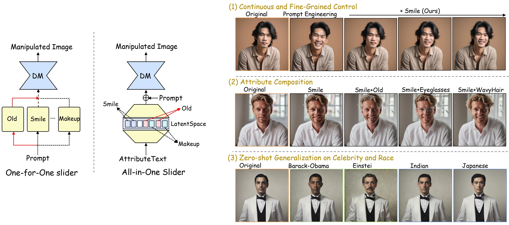

# All-in-One Slider for Attribute Manipulation in Diffusion Models

<p align="center">
  <strong>Weixin Ye</strong><sup>1,2*</sup> &nbsp;&nbsp;
  <strong>Hongguang Zhu</strong><sup>3*</sup> &nbsp;&nbsp;
  <strong>Wei Wang</strong><sup>1,2†</sup> &nbsp;&nbsp;
  <strong>Yahui Liu</strong><sup>4</sup> &nbsp;&nbsp;
  <strong>Mengyu Wang</strong><sup>1,2</sup> &nbsp;&nbsp;
  <strong>Xuecheng Nie</strong><sup>5</sup>
</p>
<p align="center">
  <sup>1</sup>Beijing Jiaotong University &nbsp;&nbsp;
  <sup>2</sup>Visual Intelligence + X International Cooperation Joint Laboratory of the Ministry of Education<br>
  <sup>3</sup>City University of Macau &nbsp;&nbsp;
  <sup>4</sup>Kuaishou &nbsp;&nbsp;
  <sup>5</sup>Meitu
</p>
<p align="center">
  <sub>* Equal contribution &nbsp;&nbsp; † Corresponding author</sub>
</p>

### **[Code](https://github.com/ywxsuperstar/ksaedit) | [arXiv](https://arxiv.org/abs/2508.19195) |[Model](https://drive.google.com/drive/folders/1xEL33wzu8we9h2XMjzklcGAKK51qYHBk?usp=sharing)**




Official implementation of the CVPR 2026 paper "All-in-One Slider for Attribute Manipulation in Diffusion Models"

**TL;DR:** We train an Attribute Sparse Autoencoder on text encoder activations to factor the embedding space into disentangled attribute directions. This lightweight module acts as a universal slider, enabling continuous control, attribute composition, and zero-shot generalization across diverse attributes without per-attribute retraining.


## 💡 Introduction

Text-to-image (T2I) diffusion models have made significant strides in generating high-quality images. However, progressively manipulating certain attributes of generated images to meet the desired user expectations remains challenging, particularly for content with rich details, such as human faces. Some studies have attempted to address this by training slider modules. However, they follow a **One-for-One** manner, where an independent slider is trained for each attribute, requiring additional training whenever a new attribute is introduced.
This not only results in parameter redundancy accumulated by sliders but also restricts the flexibility of practical applications and the scalability of attribute manipulation. 

To address this issue, we introduce the **All-in-One** Slider, a lightweight module that decomposes the text embedding space into sparse, semantically meaningful attribute directions. Once trained, it functions as a general-purpose slider, enabling interpretable and fine-grained continuous control over various attributes. Moreover, by recombining the learned directions, the All-in-One Slider supports the composition of multiple attributes and zero-shot manipulation of unseen attributes (e.g., races and celebrities). Extensive experiments demonstrate that our method enables accurate and scalable attribute manipulation, achieving notable improvements compared to previous methods. Furthermore, our method can be extended to integrate with the inversion framework to perform attribute manipulation on real images, broadening its applicability to various real-world scenarios. 


## 🚀 Getting started

**Clone the repository**

```bash
git clone https://github.com/ywxsuperstar/ksaedit.git
```

Then navigate into the project directory:

```
cd ksaedit
```

**Environment setup**

- Python = 3.10
- CUDA = 12.4
- PyTorch = 2.5.1
- Diffusers = 0.32.1

The full environment can be created and activated with:

```bash
conda env create -f slider.yaml
conda activate slider
```

## 📦 Data and checkpoints

**Pre-trained model.**
We use [Stable Diffusion XL base 1.0](https://huggingface.co/stabilityai/stable-diffusion-xl-base-1.0) as the backbone. Download the model weights and place them at `path/to/model/stabilityai/stable-diffusion-xl-base-1.0`, or update the paths in your scripts accordingly.

**Training data.**
We provide three sets of training prompts in CSV format:

- *Universal SAE Training Data* `[creat_data/prompt_attr_52.csv](creat_data/prompt_attr_52.csv)`. ~52,000 samples. Each row includes `prompt`, `evaluation_seed`, and `class` (for attributes), covering **52 face-attribute** (e.g. old, smile, makeup) with contrastive prompt templates. These contrastive prompts are used to train the universal Attribute Sparse Autoencoder for attribute disentanglement.
- *Multi-Subject Fine-tuning Data:* `[creat_data/step2_ft_data.csv](creat_data/step2_ft_data.csv)`. ~10,600 `(neg_prompt, pos_prompt)` pairs. Used for the joint fine-tuning of the pretrained K-SAE and the newly introduced Attention Pooling Aggregator (AAg) module. It provides supervision with `target_token` to accurately localize attributes to specific subjects (e.g., *man*, *woman*) in complex multi-subject scenes. 
- *Style Generalization Data:* `[creat_data/style/style.csv](creat_data/style/style.csv)`. ~4,000 prompt pairs across diverse photographic and artistic styles (e.g. black-and-white, golden-hour, fisheye) for training style sliders.


**Checkpoints.**
If you want to skip the universal SAE training, download our pre-trained K-SAE [weights](https://drive.google.com/drive/folders/1xEL33wzu8we9h2XMjzklcGAKK51qYHBk?usp=sharing) and set `--checkpoints_sae` to the extracted checkpoint directory.

## 🔧 Usage

### 1. Embedding feature extraction

Extract intermediate **text-encoder activations** for our prompt CSVs so they can be used to train the k-SAE (slider).

```bash
python extract_features/extract_sd14.py
python extract_features/extract_sdxl.py
```

### 2. Train the k-SAE slider

Train the sparse autoencoder (k-SAE) on the extracted features. Choose the script matching your backbone.

```bash
bash scripts/train/train_sd14_face.sh   # SD1.4
bash scripts/train/train_sdxl_face.sh   # SDXL
```

To use **pretrained weights** instead of training from scratch, download them from [Checkpoints](#checkpoints), and pass the checkpoint path (e.g. `--checkpoints_sae`) in your scripts.

### 3. Control image generation

**Inference / editing**: Run the provided bash scripts, which call the generation scripts with your trained (or downloaded) checkpoints.

```bash
bash scripts/face_gen_sd14.sh
bash scripts/face_gen_sdxl.sh
```

We also provide a **Jupyter notebook demo** (`demo_gen_sdxl_oneAtt52_att2sae.ipynb`) that visualizes the effect of different steering strengths on a single image.

### 4. Application

**Compositional attribute control.**
Combine multiple attribute directions (e.g. smile + old) in a single generation pass. Each attribute is encoded independently through the k-SAE and then summed to form a joint steering vector.

```bash
bash scripts/face_gen_sdxl_attAdd_comp.sh
```

**Style transfer.**
Apply learned style directions (e.g. black-and-white, golden-hour, fisheye) to arbitrary prompts via pair-based steering. Style training data follows the same format as attribute training; inference uses pair subtraction to isolate the style direction.

```bash
bash application/style/style_gen_sdxl.sh
```

**Multi-subject attribute manipulation.**
We further explore fine-tuning the pretrained k-SAE jointly with an Attention Pooling Aggregator (AAg) module to localize attribute edits to specific subjects in multi-subject scenes. See `application/ft_sae_aggre_multisub/` for details.

### 5. Evaluation

We use [Qwen2.5-VL-7B-Instruct](https://huggingface.co/Qwen/Qwen2.5-VL-7B-Instruct) as the evaluator to assess attribute manipulation quality, including semantic alignment, identity preservation, and visual coherence. The evaluation pipeline follows [ImgEdit](https://github.com/PKU-YuanGroup/ImgEdit?tab=readme-ov-file). For **identity consistency**, we adopt the pipeline from [InsightFace_Pytorch](https://github.com/TreB1eN/InsightFace_Pytorch).

## 📝 How to cite

The preprint can be cited as follows:

```bibtex
@article{ye2026allinoneslider,
      title={All-in-One Slider for Attribute Manipulation in Diffusion Models}, 
      author={Weixin Ye and Hongguang Zhu and Wei Wang and Yahui Liu and Mengyu Wang and Xuecheng Nie},
      journal={arXiv preprint arXiv:2508.19195},
      year={2026}
}
```

